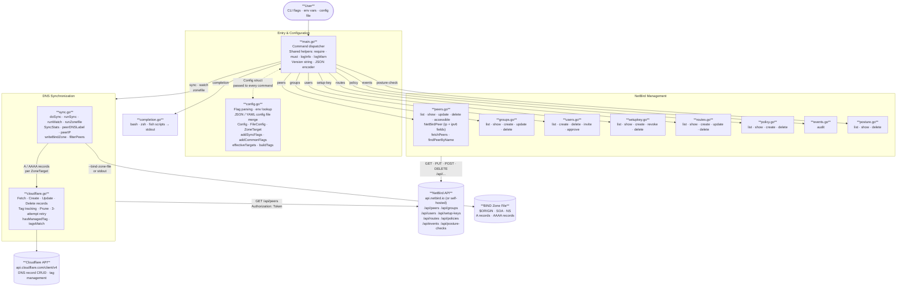

# nbctl

A command-line tool for managing [NetBird](https://netbird.io) mesh VPN networks via the NetBird REST API. Supports both NetBird Cloud and self-hosted deployments.

## Installation

```bash
git clone https://github.com/buraglio/nbctl
cd nbctl
go build -o nbctl .
```

For self-hosted NetBird, bake the management URL in at build time so you never have to pass it as a flag:

```bash
go build -ldflags="-X main.defaultNetBirdURL=https://nb.example.com" -o nbctl .
```

Requires Go 1.22 or later.

## Authentication

nbctl authenticates with a NetBird personal access token (PAT). Generate one in the NetBird dashboard under **Settings → Access Tokens**.

Pass the token via environment variable, flag, or config file:

```bash
# Environment variable (recommended for scripts)
export NETBIRD_TOKEN=nbp_...
nbctl peers list

# Inline flag
nbctl peers list --netbird-token nbp_...

# Config file
nbctl peers list --config ~/.nbctl.yaml
```

## Configuration

Every command accepts these common flags:

| Flag | Env var | Default | Description |
|---|---|---|---|
| `--netbird-url` | `NETBIRD_URL` | `https://api.netbird.io` | NetBird management URL |
| `--netbird-token` | `NETBIRD_TOKEN` | — | Personal access token |
| `--config` | — | — | Path to JSON or YAML config file |
| `--json` | — | false | Output results as JSON |
| `-v` / `--verbose` | — | false | Debug output |

Precedence (highest to lowest): CLI flags → config file → environment variables → compiled-in defaults.

### Config file

```yaml
netbird_url: https://api.netbird.io
netbird_token: nbp_...
```

For DNS sync, additional fields are supported:

```yaml
netbird_url: https://api.netbird.io
netbird_token: nbp_...

# Cloudflare (single zone)
cf_api_token: CF_TOKEN
cf_zone_id: ZONE_ID
domain: mesh.example.com
ttl: 60
prune: true
managed_tag: managed:nbctl
tags:
  - env:prod
comment: Managed by nbctl

# Optional peer filter
connected_only: false
use_hostname: false
```

For multiple zones, use a `zones` array. Each zone gets its own Cloudflare credentials and domain; all NetBird peers are synced to every zone unless further filtered.

```yaml
netbird_url: https://api.netbird.io
netbird_token: nbp_...
managed_tag: managed:nbctl
tags:
  - env:prod

zones:
  - cf_api_token: CF_TOKEN_A
    cf_zone_id: ZONE_ID_A
    domain: mesh.example.com
  - cf_api_token: CF_TOKEN_B
    cf_zone_id: ZONE_ID_B
    domain: ops.mesh.example.com
    tags:
      - team:ops
```

JSON is also accepted for all config files.

## Architecture

The diagram below shows how the source files are organized and how data flows through nbctl for each major operation.



**Key data flows:**

- **DNS sync** (`sync` / `watch`): `config.go` assembles the `Config`, `sync.go` calls `fetchPeers` from `peers.go`, then pushes A/AAAA records to `cloudflare.go` for each configured zone.
- **Zone file** (`zonefile`): same fetch path as sync, but `writeBindZone` in `sync.go` writes BIND-format text to a file or stdout — no Cloudflare involved.
- **Management commands** (`peers`, `groups`, `users`, etc.): each command file makes direct REST calls to the NetBird API using the shared `Config` built by `config.go`.
- **Watch mode**: `runWatch` in `sync.go` calls `doSync` immediately then on every tick — the rest of the pipeline is identical to one-shot `sync`.

## Commands

### peers

Manage NetBird peers. `--peer` matches by peer name or hostname.

```
nbctl peers list
nbctl peers show       --peer <name>
nbctl peers update     --peer <name> [--new-name <name>] [--ssh] [--login-expiration] [--inactivity-expiration]
nbctl peers delete     --peer <name>
nbctl peers accessible --peer <name>
```

`peers accessible` lists all peers reachable from a given peer under the current policy.

```bash
# List all peers
nbctl peers list

# Show detailed info
nbctl peers show --peer laptop-alice

# Rename a peer and enable SSH access
nbctl peers update --peer laptop-alice --new-name workstation-alice --ssh

# List which peers can reach a given peer
nbctl peers accessible --peer router-nyc

# Delete a peer
nbctl peers delete --peer old-server
```

### groups

Manage peer groups. Groups are the building blocks of policies and routes.

```
nbctl groups list
nbctl groups show   --group <name>
nbctl groups create --name <name> [--peer <id>] ...
nbctl groups update --id <id> --name <name> [--peer <id>] ...
nbctl groups delete --id <id>
```

`--peer` is repeatable. For `update`, the supplied peer list replaces the group's current members entirely.

```bash
# Create a group with two peers
nbctl groups create --name servers --peer peer-id-1 --peer peer-id-2

# Show group membership
nbctl groups show --group servers

# Rename and replace members
nbctl groups update --id <group-id> --name infra --peer peer-id-3
```

### users

Manage NetBird users and service accounts.

```
nbctl users list
nbctl users create  --email <email> [--name <name>] [--role user|admin]
nbctl users create  --service --name <name>
nbctl users delete  --id <user-id>
nbctl users invite  --id <user-id>
nbctl users approve --id <user-id>
```

For regular users `--email` is required. For service accounts (`--service`), `--name` is required instead.

```bash
# Invite a new user
nbctl users create --email alice@example.com --role admin

# Create a service account
nbctl users create --service --name ci-bot

# Re-send an invitation
nbctl users invite --id <user-id>

# Approve a pending user (self-hosted with peer approval enabled)
nbctl users approve --id <user-id>
```

### setup-key

Manage setup keys used to enroll new peers.

```
nbctl setup-key list
nbctl setup-key show   --id <key-id>
nbctl setup-key create --name <name> [--type one-off|reusable] [--expires-in <seconds>]
                       [--ephemeral] [--usage-limit <n>] [--group <id>] ...
nbctl setup-key revoke --id <key-id>
nbctl setup-key delete --id <key-id>
```

`--group` is repeatable (auto-assigns enrolling peers to those groups). `--expires-in` is in seconds (default 86400 = 1 day). `--usage-limit 0` means unlimited. Ephemeral peers are removed from the network when they disconnect.

```bash
# One-time key expiring in 7 days
nbctl setup-key create --name onboard-laptop --expires-in 604800

# Reusable key for a CI fleet, auto-assigned to a group
nbctl setup-key create --name ci-runners --type reusable --group <group-id> --ephemeral

# Revoke a key immediately
nbctl setup-key revoke --id <key-id>
```

### routes

Manage network routes that allow peers to reach subnets.

```
nbctl routes list
nbctl routes show   --id <route-id>
nbctl routes create --network-id <id> --network <CIDR> --peer <peer-id>
                    [--description <desc>] [--metric <n>] [--masquerade] [--enabled]
nbctl routes update --id <route-id> [same flags as create]
nbctl routes delete --id <route-id>
```

`--metric` defaults to 9999. `--enabled` defaults to true. `--masquerade` hides the originating peer's IP behind the gateway peer's address.

```bash
# Expose a corporate subnet via a gateway peer
nbctl routes create \
  --network-id corp-subnet \
  --network 10.0.0.0/8 \
  --peer <gateway-peer-id> \
  --masquerade \
  --description "corp office LAN"

# Disable a route without deleting it
nbctl routes update --id <route-id> --enabled=false
```

### policy

Manage access control policies. Each policy created with nbctl contains a single rule; multi-rule policies can be managed via the NetBird dashboard.

```
nbctl policy list
nbctl policy show   --id <policy-id>
nbctl policy create --name <name> [--description <desc>]
                    [--rule-name <name>] [--rule-action accept|drop]
                    [--rule-proto all|tcp|udp|icmp]
                    [--rule-port <port>] ...
                    [--rule-src <group-id>] ...
                    [--rule-dst <group-id>] ...
                    [--bidirectional] [--enabled]
nbctl policy delete --id <policy-id>
```

`--rule-port`, `--rule-src`, and `--rule-dst` are repeatable. `--bidirectional` and `--enabled` default to true.

```bash
# Allow all traffic between two groups
nbctl policy create \
  --name devs-to-servers \
  --rule-src <dev-group-id> \
  --rule-dst <server-group-id>

# Allow only HTTPS from clients to web servers
nbctl policy create \
  --name web-access \
  --rule-proto tcp \
  --rule-port 443 \
  --rule-src <client-group-id> \
  --rule-dst <web-group-id>
```

### sync

Sync NetBird peer IPs to Cloudflare DNS as A or AAAA records. One-shot; exits when done.

```
nbctl sync --domain <suffix> [flags]
```

| Flag | Env var | Default | Description |
|---|---|---|---|
| `--cf-token` | `CLOUDFLARE_API_TOKEN` | — | Cloudflare API token |
| `--cf-zone` | `CLOUDFLARE_ZONE_ID` | — | Cloudflare zone ID |
| `--domain` | `DOMAIN` | — | Domain suffix (e.g. `mesh.example.com`) |
| `--ipv4` | — | false | Sync A records (default: both when neither flag is set) |
| `--ipv6` | — | false | Sync AAAA records (default: both when neither flag is set) |
| `--ttl` | — | 60 | DNS record TTL in seconds |
| `--prune` | — | false | Delete managed records absent from NetBird |
| `--dry-run` | — | false | Preview changes without applying |
| `--connected-only` | — | false | Skip peers that are not currently connected |
| `--use-hostname` | — | false | Use machine hostname instead of NetBird DNS label |
| `--managed-tag` | — | `managed:nbctl` | Tag stamped on every managed record (prune filter) |
| `--tag <k:v>` | — | — | Extra tag (repeatable) |
| `--disable-tags` | — | false | Omit tags (required for free Cloudflare zones) |
| `--comment` | — | `Managed by nbctl` | Comment on every DNS record |
| `--proxied` | — | false | Proxy records through Cloudflare CDN |

```bash
# Dry run first
nbctl sync \
  --domain mesh.example.com \
  --cf-token $CF_TOKEN \
  --cf-zone $CF_ZONE \
  --dry-run

# Sync and prune stale records
nbctl sync \
  --domain mesh.example.com \
  --cf-token $CF_TOKEN \
  --cf-zone $CF_ZONE \
  --prune

# Sync only connected peers, add an env tag
nbctl sync \
  --domain mesh.example.com \
  --connected-only \
  --tag env:prod \
  --config ~/.nbctl.yaml
```

> **Cloudflare plan note:** DNS record tags require a paid Cloudflare plan. Use `--disable-tags` on free zones.

### zonefile

Generate a BIND-format zone file from NetBird peer IPs.

```
nbctl zonefile --domain <suffix> [flags]
```

Accepts all the same peer-filtering flags as `sync` (`--connected-only`, `--use-hostname`, `--ipv4`, `--ipv6`) plus:

| Flag | Default | Description |
|---|---|---|
| `--bind-zone-file <path>` | stdout | Write zone file to this path |
| `--bind-zone-dir <dir>` | — | Write one file per zone to this directory (multi-zone mode) |
| `--bind-ns <ns>` | — | NS record(s) for the zone (repeatable) |
| `--bind-soa-email <email>` | `hostmaster.<domain>.` | SOA RNAME |
| `--bind-reload-cmd <cmd>` | — | Shell command to run after each write (e.g. `rndc reload`) |
| `--bind-fragment` | false | Write only A/AAAA records — no SOA/NS header |
| `--ttl` | 60 | Record TTL |

```bash
# Print zone to stdout
nbctl zonefile \
  --domain mesh.example.com \
  --bind-ns ns1.mesh.example.com.

# Write to file and reload BIND
nbctl zonefile \
  --domain mesh.example.com \
  --bind-ns ns1.mesh.example.com. \
  --bind-zone-file /etc/bind/mesh.example.com.zone \
  --bind-reload-cmd "rndc reload mesh.example.com"

# Records-only fragment for $INCLUDE in an existing zone
nbctl zonefile --domain mesh.example.com --bind-fragment > /etc/bind/netbird.inc
```

Example output:

```
; Generated by nbctl 0.1.0 — 2026-07-02T12:00:00Z
$ORIGIN mesh.example.com.
$TTL 60

@  IN SOA  ns1.mesh.example.com. hostmaster.mesh.example.com. (
               1751500000 ; serial
               3600       ; refresh
               900        ; retry
               604800     ; expire
               60         ; minimum
           )

@  IN NS   ns1.mesh.example.com.

router    IN A  100.64.0.1
laptop    IN A  100.64.0.2
server    IN A  100.64.0.3
```

### watch

Sync to Cloudflare continuously on a repeating interval.

```
nbctl watch --domain <suffix> --interval <duration> [same flags as sync]
```

| Flag | Default | Description |
|---|---|---|
| `--interval` | `5m` | How often to sync (e.g. `30s`, `5m`, `1h`) |

```bash
nbctl watch \
  --domain mesh.example.com \
  --config ~/.nbctl.yaml \
  --interval 5m
```

Syncs immediately on startup, then repeats. Runs indefinitely; use a process supervisor or systemd to manage lifecycle.

### events

View audit events from the NetBird management plane.

```
nbctl events audit
```

Prints timestamp, activity type, initiator email, and target ID. Use `--json` to pipe into `jq`.

```bash
nbctl events audit --json | jq '.[] | select(.activity | contains("peer"))'
```

### posture-check

View and delete posture checks that enforce device compliance requirements (minimum NetBird version, OS version, geolocation, etc.). Create and update operations are managed via the NetBird dashboard.

```
nbctl posture-check list
nbctl posture-check show   --id <check-id>
nbctl posture-check delete --id <check-id>
```

### completion

Generate shell completion scripts.

```bash
# bash — add to ~/.bashrc
nbctl completion bash >> ~/.bashrc

# zsh — add to ~/.zshrc
nbctl completion zsh >> ~/.zshrc

# fish — permanent install
nbctl completion fish > ~/.config/fish/completions/nbctl.fish
```

## JSON output

All commands support `--json` for structured output:

```bash
# List connected peers
nbctl peers list --json | jq '.[] | select(.connected) | .name'

# List group names
nbctl groups list --json | jq '.[].name'

# Show a peer as JSON
nbctl peers show --peer router --json
```

## Self-hosted NetBird

Point nbctl at your self-hosted management API (default port 33073):

```bash
export NETBIRD_URL=https://nb.example.com:33073
nbctl peers list
```

Or bake the URL into the binary at build time:

```bash
go build -ldflags="-X main.defaultNetBirdURL=https://nb.example.com:33073" -o nbctl .
```

## Running as a service

To keep DNS in sync continuously, run `nbctl watch` under a process supervisor.

### systemd

```ini
# /etc/systemd/system/nbctl-sync.service
[Unit]
Description=NetBird → Cloudflare DNS sync
After=network-online.target
Wants=network-online.target

[Service]
Type=simple
ExecStart=/usr/local/bin/nbctl watch \
    --config /etc/nbctl/config.yaml \
    --interval 5m
Restart=on-failure
RestartSec=10s

[Install]
WantedBy=multi-user.target
```

```bash
systemctl daemon-reload
systemctl enable --now nbctl-sync
```

## Development

```bash
# Build
go build ./...

# Test
go test ./...

# Run specific tests
go test -run TestFetchPeers -v
```

Dependencies: Go 1.22+ standard library and `gopkg.in/yaml.v3` (config file YAML parsing only).

## License

MIT
